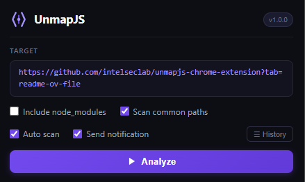

# UnmapJS – Source Map Extractor

> A Chrome extension that recovers original source files from JavaScript source maps of any React, Next.js, Vite, or Webpack-based web application.



---

## What It Does

Modern web applications bundle and minify their JavaScript before deployment. However, many production sites accidentally (or intentionally) expose **source map** (`.map`) files alongside their bundles. These files contain the original, human-readable source code.

**UnmapJS** automates the process of:

1. **Discovering** all JavaScript chunk files loaded by a page (via `<script>` tags, the Performance API, build manifests, and common route probing).
2. **Detecting** sourcemap references (`//# sourceMappingURL=...`) inside those chunks.
3. **Extracting** the original source files from the sourcemap JSON.
4. **Packaging** everything into a downloadable `.zip` archive.

It also runs a **passive background scanner** on every page you visit — silently checking for sourcemaps and notifying you when source code is found, without any manual interaction required.

---

## Features

- One-click analysis with live step-by-step progress
- Passive auto-scan on every tab navigation with badge indicator
- Discovers chunks via HTML parsing, Performance API, and Next.js build manifests
- Optional common-path probing (login, dashboard, etc.)
- Optional `node_modules` inclusion / exclusion
- Browser notification when sourcemaps are detected
- History page listing all previously found sites
- Downloads recovered source files as a structured ZIP archive

---

## Installation (Developer Mode)

1. Clone or download this repository.
2. Open Chrome and navigate to `chrome://extensions/`.
3. Enable **Developer mode** (top-right toggle).
4. Click **Load unpacked** and select the project folder.

To pack as a `.crx` file:
```
chrome://extensions/ → Pack Extension → select project folder
```

---

## Tech Stack

| Component | Details |
|---|---|
| Manifest | V3 |
| Background | Service Worker (`background.js`) |
| Source discovery | `src/discovery.js` |
| Analysis engine | `src/engine.js` |
| Passive scanner | `src/scanner.js` |
| ZIP packaging | [JSZip](https://stuk.github.io/jszip/) |

---

## Disclaimer

This tool is intended for **authorized security testing**, **bug bounty research**, and **educational purposes** only. Only use it on applications you have explicit permission to test. The author is not responsible for any misuse.

---

## License

MIT © 2026 UnmapJS Contributors — see [LICENSE](LICENSE) for details.