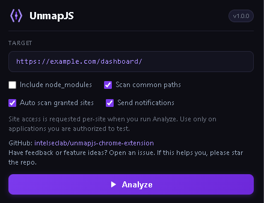
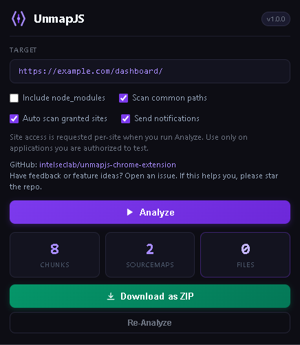
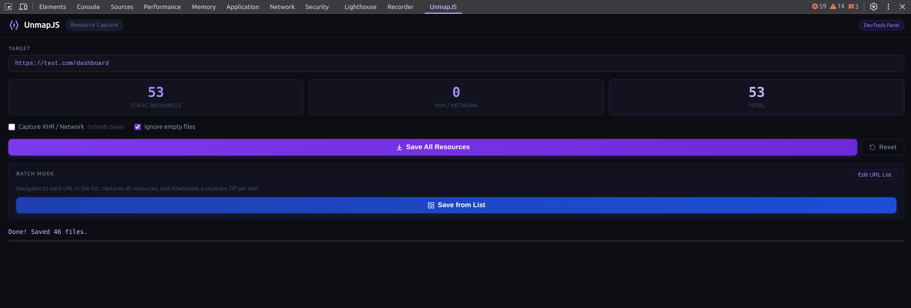

# UnmapJS – Source Map Extractor

> A Chrome extension that recovers original source files from JavaScript source maps of any React, Next.js, Vite, or Webpack-based web application.

#### 1. **Discover** all JavaScript chunks loaded by a page.

#### 2. **Detect** sourcemap references inside those chunks.
#### 3. **Extract** the original source files from the sourcemap JSON.


#### Dev tools panel


---

## What It Does

Modern web applications bundle and minify their JavaScript before deployment. However, many production sites accidentally (or intentionally) expose **source map** (`.map`) files alongside their bundles. These files contain the original, human-readable source code.

**UnmapJS** automates the process of:

1. **Discovering** all JavaScript chunk files loaded by a page (via `<script>` tags, the Performance API, build manifests, and common route probing).
2. **Detecting** sourcemap references (`//# sourceMappingURL=...`) inside those chunks.
3. **Extracting** the original source files from the sourcemap JSON.
4. **Packaging** everything into a `.zip` archive for local export.

It can also run a **passive background scanner** (optional) on pages where you granted access, notifying you when source code is found.

---

## Features

- One-click analysis with live step-by-step progress
- Optional passive auto-scan on navigation with badge indicator
- Discovers chunks via HTML parsing, Performance API, and Next.js build manifests
- Optional common-path probing (login, dashboard, etc.)
- Optional `node_modules` inclusion / exclusion
- Browser notification when sourcemaps are detected
- Downloads recovered source files as a structured ZIP archive
- **DevTools panel** — captures all page resources (JS, CSS, images, fonts, XHR) in memory and downloads them as ZIP with preserved folder structure
- **Batch URL mode** — navigate and save resources from a list of URLs automatically
- **Fallback download** — when sourcemaps have no embedded source code, automatically fetches and packages the raw JS chunks instead

---

## Installation (Developer Mode)

1. Clone or download this repository.
2. Open Chrome and navigate to `chrome://extensions/`.
3. Enable **Developer mode** (top-right toggle).
4. Click **Load unpacked** and select the project folder.

To pack as a `.crx` file:
```
chrome://extensions/ → Pack Extension → select project folder
```

---

## Community

GitHub repository: https://github.com/intelseclab/unmapjs-chrome-extension

Feedback and feature requests are welcome via GitHub Issues. If UnmapJS is useful for your workflow, please consider starring the repository.

---

## Tech Stack

| Component | Details |
|---|---|
| Manifest | V3 |
| Background | Service Worker (`background.js`) |
| Source discovery | `src/discovery.js` |
| Analysis engine | `src/engine.js` |
| Passive scanner | `src/scanner.js` |
| Source extractor | `src/extractor.js` |
| HTTP fetcher | `src/fetcher.js` (page-context + SW, CORS bypass) |
| DevTools panel | `panel.html` / `panel.js` / `panel.css` |
| ZIP packaging | [JSZip](https://stuk.github.io/jszip/) |

---

## Permissions & Privacy

| Permission | Reason |
|---|---|
| `activeTab`, `scripting` | Inject script to collect loaded chunks and page HTML |
| `host_permissions` (`http://*/`, `https://*/`) | Fetch JS chunks and sourcemaps cross-origin without CORS restrictions |
| `tabs` | Read current tab URL; navigate tab in batch mode |
| `downloads`, `downloads.shelf` | Trigger ZIP downloads from the DevTools panel |
| `storage` | Persist auto-scan and notification settings locally |
| `notifications` | Alert when sourcemaps are found during passive scan |

- Auto-scan is **off by default** and only activates on navigation when enabled.
- Notification alerts are **off by default**.
- All data stays on your machine — nothing is sent to external servers by this extension.

---

## Changelog

### v1.1.0 — 2026-04-11

#### Added
- **DevTools panel** (`panel.html` / `panel.js`) — captures all resources already loaded by the browser (JS, CSS, images, fonts, HTML) via `chrome.devtools.inspectedWindow.getResources` and packages them as a ZIP with full folder structure preserved.
- **XHR / Network capture** — optional toggle in the DevTools panel hooks `chrome.devtools.network.onRequestFinished` and `getHAR()` to capture live fetch/XHR responses alongside static resources.
- **Batch URL mode** — enter a list of URLs in the DevTools panel; the extension navigates to each, captures all resources, and downloads a separate ZIP per site.
- **Raw chunk fallback** — when a sourcemap is found but contains no embedded `sourcesContent` and referenced source files cannot be fetched, the popup automatically re-fetches and packages the raw compiled JS chunks so a download is always offered.
- **External source fetching** — before falling back to raw chunks, the engine now attempts to resolve and fetch source files referenced by URL in the sourcemap's `sources[]` array (handles relative paths and absolute URLs; skips virtual bundler paths such as `webpack:///`).

#### Changed
- `host_permissions` promoted from optional to required (`http://*/`, `https://*/`) — eliminates CORS errors when fetching JS chunks and sourcemaps from third-party CDN origins.
- Removed per-site runtime permission prompts; access to any HTTP/HTTPS URL is now declared in the manifest.
- Auto-scan setting renamed from "Auto scan granted sites" to "Auto scan on navigation" to reflect the updated permission model.
- Download button is disabled with a contextual explanation when no files can be recovered, and relabelled **"Download JS Chunks"** when the raw-chunk fallback is active.

#### Fixed
- `✕ No files to download` error shown after a successful analysis — caused by sourcemaps with empty `sourcesContent`; the download button now correctly reflects what is available.

---

### v1.0.0 — initial release

- Popup-based source map scanner with three-step analysis (chunk discovery → sourcemap detection → source extraction).
- ZIP download of recovered source files with bundler-prefix stripping and path normalisation.
- Passive background scanner with badge indicator and optional browser notifications.
- Next.js build manifest expansion and common-path probing.

---

## Disclaimer

This tool is intended for **authorized security testing**, **bug bounty research**, and **educational purposes** only. Only use it on applications you have explicit permission to test. The author is not responsible for any misuse.

---

## License

MIT © 2026 UnmapJS Contributors - see [LICENSE](LICENSE) for details.
